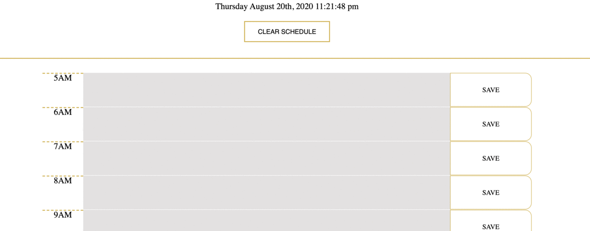

# Day_Planner
---

## Table of Contents
---
* [Description](#Description)
* [Installation](#Installation)
* [Usage](#Usage)
* [Contributors](#Contributors)
* [Test](#Test)
* [License](#License)
* [Questions](#Questions)
* [Demo](#Demo)

## Description 
---
This program is a daily planner for users to put in their daily tasks for a reminder. The user will be able to see the working hours in the scheduler. They will be able to click and write about their jobs. That will be saved into their local storage, and they can refer back to it without losing information—the colors of the scheduler changes with the current hour. Any hours past the time will be grayed out, the current hour's text box will be red, and any future events will be green. When the hour is passed the user can't update the event. The user also got an extra feature to clear out the whole schedule with a click of a button saying "clear schdule" and they can use it in any devices because the program is responsive. 

## Installation 
---
No Installation Required 

## Usage 
---
In order to run the project just click on the link and start planning out your day, the information will be stored to your local folder. 

## Contributors
---
Shubhangi Mundhada

## Test
---
Jest

## License
---
MIT

## Questions
---
Github Link - https://github.com/smundhada
Email - shubhimundhada@gmail.com

# Demo 
---
## [demo-link](https://smundhada.github.io/Day_Planner/)

